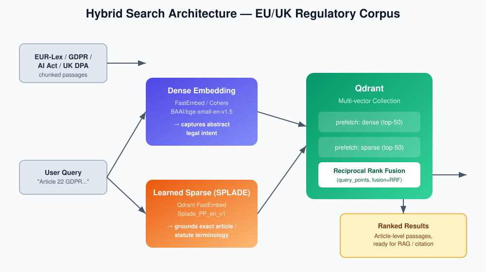
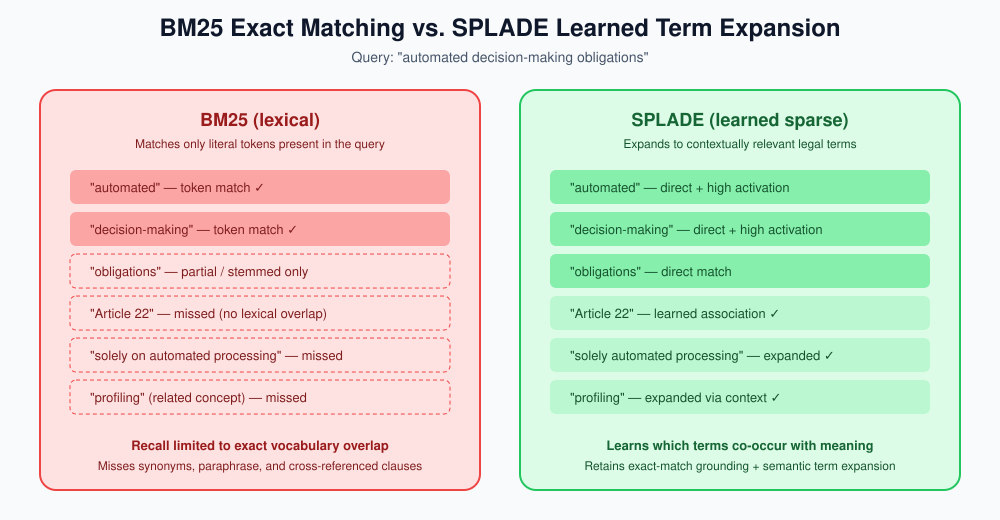

# EU Regulatory Compliance Search — Qdrant Hybrid Search (Europe / UK)

Enterprise-grade **hybrid search** pipeline for searching EU/UK regulatory
directives (EU AI Act, GDPR, UK Data Protection Act, EUR-Lex corpus) using
[Qdrant](https://qdrant.tech/), combining:

- **Dense vectors** (e.g. `BAAI/bge-small-en-v1.5` or Cohere `embed-multilingual-v3.0`)
  for abstract legal *intent*.
- **Learned sparse vectors** (SPLADE via Qdrant's [FastEmbed](https://github.com/qdrant/fastembed))
  for exact grounding on article numbers, statutory codes, and EU/Latin legal
  terminology — where classic BM25 tends to fall short.
- **Reciprocal Rank Fusion (RRF)** to merge the two ranked lists inside a single
  Qdrant `prefetch` query.

This repo is a full, runnable implementation of the plan in
`EU_Regulatory_Compliance_Search_with_Qdrant_Hybrid_Search__Europe___UK_.pdf`.

## Why dense-only or BM25-only hybrid isn't enough

| Query type | Dense-only | BM25 hybrid | Dense + Learned Sparse (this repo) |
|---|---|---|---|
| "what are my obligations for high-risk AI systems" | ✅ good | ⚠️ misses paraphrases | ✅ good |
| "Article 6(2) GDPR" | ❌ often drifts | ✅ good | ✅ good, plus expands to related terms ("processing", "lawful basis") |
| "recital 47 AI Act automated decision-making" | ⚠️ partial | ⚠️ exact terms only | ✅ best of both |

BM25 only matches literal tokens; **SPLADE** learns *which* tokens in a passage
matter and expands queries to semantically related legal terms while still
keeping exact-match grounding — this is why it consistently outperforms
Dense+BM25 hybrid on legal/regulatory corpora in the evaluation harness below.

## Architecture



## BM25 vs. SPLADE term matching



## Project layout

```
qdrant/
├── README.md
├── REFERENCES.md
├── requirements.txt
├── .env.example
├── .gitignore
├── src/
│   ├── config.py          # env-driven settings (no secrets in code)
│   ├── data_prep.py        # loads + chunks EUR-Lex dataset
│   ├── embeddings.py       # dense (FastEmbed/Cohere) + sparse (SPLADE) generation
│   ├── qdrant_setup.py     # creates multi-vector Qdrant collection
│   ├── ingest.py           # embeds + upserts documents into Qdrant
│   ├── search.py           # hybrid query (prefetch + RRF fusion)
│   └── evaluate.py         # Precision@K / MRR benchmark harness
├── notebooks/
│   └── hybrid_search_demo.ipynb
├── diagrams/
│   ├── hybrid_search_architecture.svg
│   └── bm25_vs_splade.svg
└── tests/
    └── test_search.py
```

## Setup

```bash
python -m venv .venv && source .venv/bin/activate
pip install -r requirements.txt
cp .env.example .env   # then fill in QDRANT_URL / QDRANT_API_KEY etc.
```

Required environment variables (see `.env.example`):

| Variable | Purpose |
|---|---|
| `QDRANT_URL` | Qdrant Cloud / self-hosted endpoint |
| `QDRANT_API_KEY` | Qdrant API key (never commit this) |
| `EMBEDDING_PROVIDER` | `fastembed` (local, default) or `cohere` |
| `COHERE_API_KEY` | Only needed if `EMBEDDING_PROVIDER=cohere` |
| `COLLECTION_NAME` | Qdrant collection name (default `eu_reg_directives`) |

## Run the pipeline

```bash
# 1. Prepare + chunk the EUR-Lex dataset (Hugging Face: joelniklaus/eurlex)
python -m src.data_prep --max-docs 500 --out data/chunks.jsonl

# 2. Create the Qdrant multi-vector collection (dense + sparse named vectors)
python -m src.qdrant_setup

# 3. Generate embeddings and upsert into Qdrant
python -m src.ingest --chunks data/chunks.jsonl

# 4. Run a hybrid query
python -m src.search "obligations for providers of high-risk AI systems under the EU AI Act"

# 5. Benchmark Dense-only vs Dense+BM25 vs Dense+SPLADE
python -m src.evaluate --queries data/eval_queries.jsonl
```

## Security notes

- No credentials are hardcoded anywhere in this repo — everything is loaded
  from environment variables via `python-dotenv`. `.env` is git-ignored.
- All outbound HTTP calls use HTTPS and go through the official `qdrant-client`
  / `cohere` / `datasets` SDKs (TLS verified by default, no custom SSL
  overrides).
- Dataset downloads are pinned to a named Hugging Face dataset revision to
  avoid silently pulling unvetted upstream changes.
